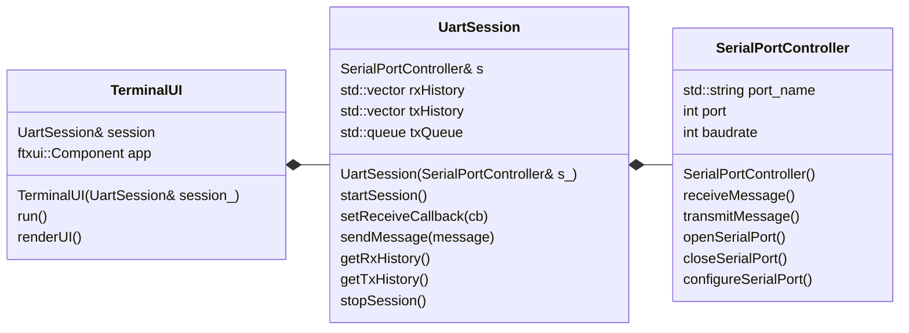
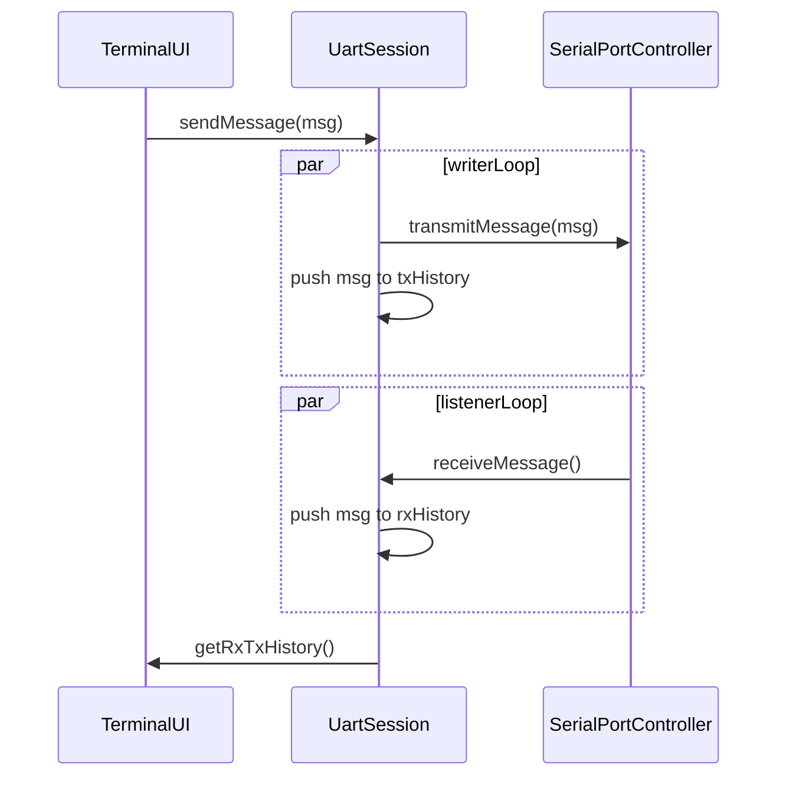

# CPP UART Terminal

**Description**

A multithreaded UART terminal written in modern C++ with a text-based user interface. 

# YouTube demo
[](https://www.youtube.com/watch?v=OZpuCOMibgE)


# How to build and run

```
~$ git clone https://github.com/SzymonGogulski/CPP_UART_TERMINAL.git
~$ cd CPP_UART_TERMINAL/
~/CPP_UART_TERMINAL$ git submodule update --init
~/CPP_UART_TERMINAL$ cmake -S . -B build
~/CPP_UART_TERMINAL$ cmake --build ./build
~/CPP_UART_TERMINAL$ sudo ./build/source/UartTerminal /dev/ttyACM0 115200
```

# UML diagrams

### Class relations


### Sequence diagram




# Built with
1. Ubuntu24.04
2. C++ 23
3. gcc 15.1.0 

# Next steps
1. Add connection configuration menu
2. Add multiple port connection

# References
1. [FTXUI](https://github.com/ArthurSonzogni/FTXUI)
2. [C++ Serial Port Connection](https://www.geeksforgeeks.org/cpp/serial-port-connection-in-cpp/)
3. [Linux Serial Ports Using C/C++](https://blog.mbedded.ninja/programming/operating-systems/linux/linux-serial-ports-using-c-cpp/)
